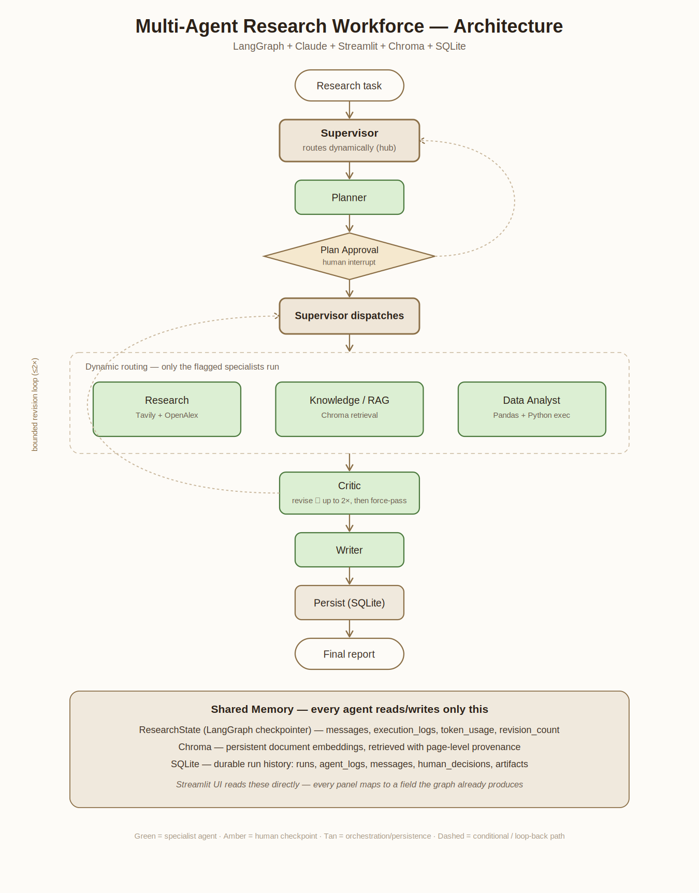

# Multi-Agent Research Workforce

A general-purpose **AI research workforce** built with **LangGraph + Claude + Streamlit**.
A Supervisor dynamically routes a research question through six specialized agents,
gathers web + academic evidence, runs RAG over uploaded documents, analyzes datasets
in Python, critiques the work, pauses for human approval, and produces a cited,
chart-embedded PDF report.

> Full design contract: see [`ARCHITECTURE.md`](ARCHITECTURE.md) — the single source of truth.
> Standalone diagram: [`architecture_diagram.png`](architecture_diagram.png).

## Architecture



The Supervisor is the hub: every specialist returns to it, and it decides the next hop.
Routing is dynamic for Knowledge/RAG and Data Analyst (only run when a PDF/dataset is
uploaded). **Known limitation:** Research currently always runs regardless of question
content — `need_web`/`need_academic` are not yet conditioned on the plan's actual
evidence needs (see `agents/supervisor.py`). A pure "dataset-only, no web search" route
is not yet reachable.

## Agents

| Agent | Responsibility | Tools |
|---|---|---|
| Supervisor | Routing, delegation, bounded revision control | — |
| Planner | Objectives, subtasks, success criteria | Claude |
| Research | Web + academic evidence w/ provenance | Tavily, OpenAlex |
| Knowledge/RAG | Retrieve from uploaded docs, page-level provenance | Chroma |
| Data Analyst | Profiling, cleaning, stats, charts, Python execution | Pandas, Python |
| Critic | Quality/methodology checks, bounded revision (≤2) | Claude |
| Writer | Final structured, cited report | Claude |

## Memory

- **Short-term:** `ResearchState` via LangGraph's in-memory checkpointer — supports
  pause/resume across the HITL interrupt.
- **Persistent knowledge:** Chroma (local default embeddings, `all-MiniLM-L6-v2`) —
  survives restarts, indexed PDFs are retrievable across runs.
- **Durable records:** SQLite (`artifacts/workforce.db`) — every run's status, logs,
  messages, human decisions, and chart artifacts, written automatically by a terminal
  graph node. Browsable in the Dashboard's Memory tab.

## Quick start

```bash
python -m venv .venv && source .venv/bin/activate
pip install -r requirements.txt
cp .env.example .env        # add ANTHROPIC_API_KEY, TAVILY_API_KEY, OPENALEX_MAILTO

# CLI smoke test (auto-approves the HITL checkpoint):
AUTO_APPROVE=1 python main.py

# Launch the UI — Home (input/report) + Dashboard (graph/trace/memory/cost) pages:
streamlit run ui/app.py

# Tests:
AUTO_APPROVE=1 pytest -q
```

## UI

Two pages (Streamlit's native `pages/` convention):

- **Home** (`ui/app.py`) — research question input, file upload, structured plan
  review with approve/reject, final report preview with embedded charts, PDF +
  Markdown download.
- **Dashboard** (`ui/pages/1_Dashboard.py`) — a *per-run* colored execution graph
  (not a static diagram — shows exactly which nodes ran, were skipped, or are
  currently paused), agent trace, chat-style communication log grouped by revision
  cycle, memory viewer (SQLite + Chroma + live state), analysis charts, and a
  token/cost breakdown with each agent's resolved model and reasoning effort.

## Status

All seven graph nodes (Supervisor + 6 specialists) run real logic, not stubs. The
full pipeline — Planner → HITL → dynamic dispatch → bounded Critic revision loop →
Writer → SQLite persistence — has been verified end-to-end, including the reject
path, the revision loop's termination guard, and PDF export with embedded charts
and a data-cleaning summary.

## Structure

```
agents/   base_agent (Claude calls, model/effort resolution) + supervisor,
          planner, researcher, knowledge, data_analyst, critic, writer
graph/    state.py (ResearchState schema), workflow.py (graph, edges, HITL, revise, persist)
tools/    web_search (Tavily), academic_search (OpenAlex), rag (chunk/embed/retrieve),
          python_executor (sandboxed subprocess), report_export (PDF via ReportLab)
memory/   vector_store.py (Chroma), database.py (SQLite)
ui/       app.py (Home), graph_viz.py (per-run diagram builder), pages/1_Dashboard.py
config.py   main.py   ARCHITECTURE.md   architecture_diagram.png
```

## Known limitations

- Research runs on every query regardless of content (see Architecture note above).
- Python execution is process-isolated (subprocess + env scrubbing + timeout), not a
  hardened sandbox — appropriate for a trusted single-user demo, not production
  multi-tenant use. See `ARCHITECTURE.md` §15.
- Chroma/SQLite state is local-disk; no multi-user or cloud persistence.
