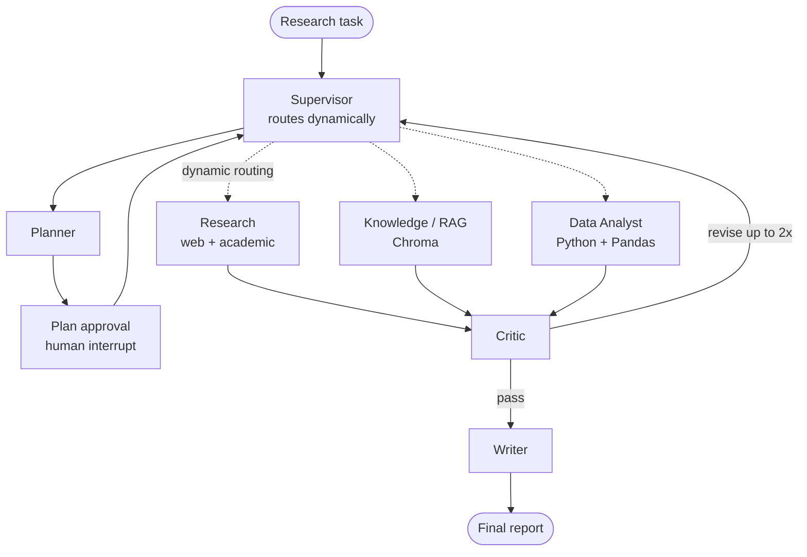

# Multi-Agent Research Workforce

A general-purpose **AI research workforce** built with **LangGraph + Claude + Streamlit**.
A Supervisor dynamically routes a research question through six specialized agents,
gathers web + academic evidence, runs RAG over uploaded documents, analyzes datasets
in Python, critiques the work, pauses for human approval, and writes a final report.

> Full design contract: see [`ARCHITECTURE.md`](ARCHITECTURE.md) — the single source of truth.

## Architecture



The Supervisor is the hub: every specialist returns to it, and it decides the next hop.
Routing is dynamic — a dataset-only task never invokes Research or RAG.

## Agents

| Agent | Responsibility | Tools |
|---|---|---|
| Supervisor | Routing, delegation, revision control | — |
| Planner | Objectives, subtasks, success criteria | Claude |
| Research | Web + academic evidence w/ provenance | Tavily, OpenAlex |
| Knowledge/RAG | Retrieve from uploaded docs | Chroma |
| Data Analyst | EDA, stats, charts, Python execution | Pandas, Python |
| Critic | Quality/methodology checks, bounded revision | Claude |
| Writer | Final structured report | Claude |

## Memory
- **Short-term:** `ResearchState` via LangGraph checkpointer (resumable).
- **Persistent knowledge:** Chroma (default local embeddings).
- **Records:** SQLite (sessions, runs, logs, decisions).

## Quick start
```bash
python -m venv .venv && source .venv/bin/activate
pip install -r requirements.txt
cp .env.example .env        # add ANTHROPIC_API_KEY, TAVILY_API_KEY

# Run the skeleton with no keys (all nodes stubbed):
AUTO_APPROVE=1 python main.py

# Launch the UI:
streamlit run ui/app.py

# Tests:
AUTO_APPROVE=1 pytest -q
```

## Status: walking skeleton
The full graph runs end-to-end **today** with every node stubbed and zero API keys.
Build order (see ARCHITECTURE.md §8): swap each stub for a real agent without ever
breaking the runnable system — Supervisor+Planner+HITL, then Research, RAG, Data
Analyst, Critic+Writer, then polish.

## Structure
```
agents/  base_agent + supervisor, planner, researcher, knowledge, data_analyst, critic, writer
graph/   state.py (ResearchState), workflow.py (graph, edges, routing, HITL)
tools/   web_search, academic_search, rag, python_executor
memory/  vector_store (Chroma), database (SQLite)
ui/      app.py (Streamlit)
config.py  main.py  ARCHITECTURE.md
```
